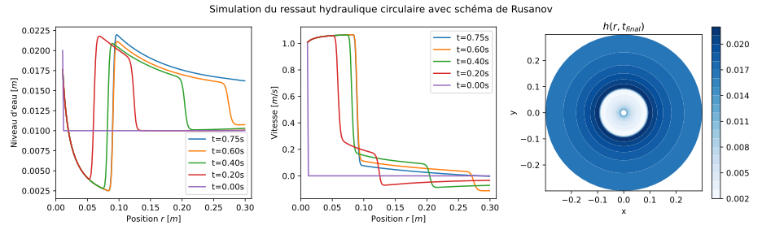
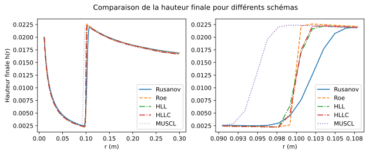

## Projet d'EDPs : Le Ressaut Hydraulique.

> ⚠️ Ce répertoire ne contient pas tous les codes utilisés, mais il contient la base et tous nos schémas de résolution.

_Noé DANIEL & Richard PATEAU_

### Résolution via volumes finis avec différents schémas

### Comparaison à la théorie stationnaire de Froude

